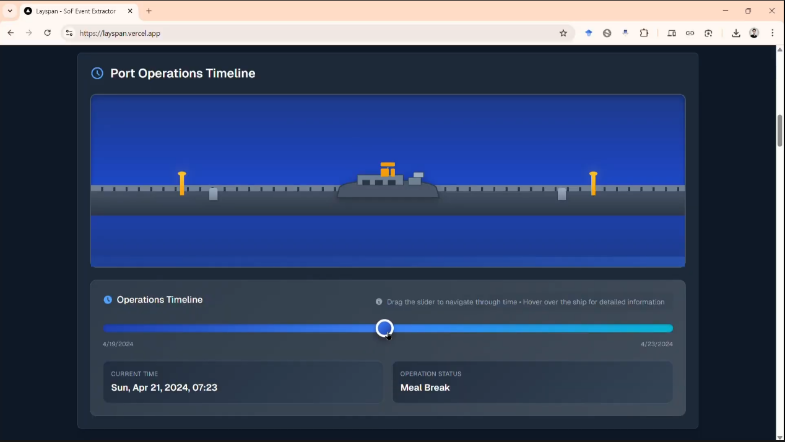

<div align="center">

# Layspan – AI Statement of Facts (SoF) Event & Laytime Intelligence

**Submission by Team Innovators Nexus for MariTHON 2025**

Interactive maritime operations intelligence: upload multi‑document Statements of Facts (PDF / Word / Images), extract every operational event with OCR + LLM reasoning, navigate an animated timeline, and export structured data (JSON / CSV) for downstream laytime & performance analysis.

<!-- Primary showcase image (single screenshot) -->


<sub>If the image above does not render on GitHub: verify that `public/media/image3.png` is committed (case‑sensitive), then refresh. The Markdown form is used for broad renderer compatibility.</sub>

<br />

### 🎥 Demo Video
[Watch the end‑to‑end product walkthrough (Google Drive)](https://drive.google.com/file/d/1A64DAU21OGQ2BiUoIWeGV-Qqz6G5FaHz/view?usp=sharing)

</div>

## ✨ Core Value
Turn raw SoF documents into: 
1. A chronologically ordered event dataset (start / end / duration / efficiency). 
2. Operational intelligence (delays, weekend time, weather, equipment breakdowns, productivity percentages). 
3. A visual, scrubbable port operations timeline with contextual vessel status indicators.

---

## 🧱 Architecture Overview

| Layer | Responsibility | Key Tech |
|-------|----------------|----------|
| UI (App Router / React 19) | File upload, processing feedback, timeline viz, analysis panels, exports | Next.js 15 (App Router), Tailwind styles (custom), React client components |
| API Route `app/api/process-document/route.js` | Batch ingest & orchestrate OCR + AI analysis | Next.js Edge/Node runtime (default), Azure Document Intelligence (Layout model), Google Gemini 2.0 Flash |
| OCR Extraction | High‑fidelity text + table structure from PDFs / DOC(X) / images | `@azure-rest/ai-document-intelligence` prebuilt-layout |
| AI Reasoning | Normalize & classify events, compute durations & efficiency, produce JSON | `@google/generative-ai` |
| Front-End Data Model | Transform AI JSON into events array for visualization & export | Custom mapping in `app/page.js` |
| Visualization | Animated vessel & status timeline with slider-scrubbing | `PortVisualization.jsx` + bespoke SVG / CSS animations |

### Data Flow
1. User selects one or more SoF files (`FileUpload.jsx`).
2. All files posted together as `FormData` to `/api/process-document`.
3. Server: each file streamed → Azure Document Intelligence (Layout) → raw text + reconstructed tables.
4. Combined multi-document corpus + structured table rows injected into a domain‑tuned prompt.
5. Gemini returns a JSON object (events[], analysis{}). Raw markdown fences are stripped → JSON parsed.
6. Events passed to the client, transformed into internal schema and rendered:
	 - `PortVisualization` (status inference, progress %, active events)
	 - `AnalysisPanel` (efficiency metrics, insights, delays) *(component not shown above but present)*
	 - `ResultsTable` (sortable, downloadable dataset)
7. User exports JSON / CSV for laytime calculators or BI.

### Key Design Choices
* **All Events Preserved** – The current API version deliberately does not deduplicate; it preserves the model output exactly (duplicate filtering is a planned enhancement—see Roadmap).
* **Prompt-Guided JSON Contract** – Strict, domain-rich instructions maximize structured consistency.
* **Stateless Processing** – No persistence; every request is isolated (safe for multi-tenant deployment when credentials are scoped).
* **Progressive Enhancement** – Front-end infers status (Working / Meal Break / Rain Delay / Breakdown etc.) via keyword heuristics so new event labels remain backward compatible.

---

## 📁 Project Structure (trimmed)
```
src/
	app/
		page.js                # Main UI composition
		api/process-document/  # AI + OCR orchestration
	components/ui/
		FileUpload.jsx         # Multi-file drag & drop input
		ProcessingStatus.jsx   # Progress + states
		PortVisualization.jsx  # Animated timeline & vessel status
		AnalysisPanel.jsx      # KPIs, insights, delay factors
		ResultsTable.jsx       # Sortable, exportable events
		FeatureCard.jsx, Header.jsx, etc.
```

---

## 🧪 Event JSON Schema (AI Output → Internal Mapping)
Raw Gemini output snippet (simplified):
```json
{
	"events": [
		{
			"event_description": "Arrival",
			"event_date": "2024-04-19",
			"event_start_time": "15:40",
			"event_end_time": "15:40",
			"duration": "00:00",
			"efficiency_rate": 0
		}
	],
	"analysis": { "time_breakdown": { ... }, "efficiency_analysis": { ... } }
}
```
Client transforms each record into:
```ts
type Event = {
	event: string;              // from event_description
	startTime: string;          // ISO date + 'T' + hh:mm
	endTime?: string | null;    // same assembly (if present)
	duration?: string;          // "HH:MM" or derived
	efficiency_rate?: number | 'N/A';
	description?: string;       // falls back to event_description
};
```

---

## 🖥️ Running Locally

### 1. Clone & Install
```bash
git clone <your-fork-url>
cd Layspan
npm install
```

### 2. Configure Environment
Create `.env.local` in project root:
```
AZURE_DOCUMENT_INTELLIGENCE_ENDPOINT=https://<your-resource>.cognitiveservices.azure.com/
AZURE_DOCUMENT_INTELLIGENCE_KEY=<<azure-key>>
GEMINI_API_KEY=<<gemini-key>>
```

### 3. Start Dev Server
```bash
npm run dev
```
Visit: http://localhost:3000

### 4. Upload Test
Drag multiple SoF PDFs / Word docs / images into the drop zone and start processing.

---

## 🔐 Security & Operational Notes
* Secrets are sourced only at runtime (never commit `.env.local`).
* No data stored server-side; ephemeral in-memory processing.
* Add rate limiting / auth (e.g., middleware) before production multi-tenant exposure.
* Azure & Gemini usage costs scale by pages and prompt size—monitor via provider dashboards.

---

## 🚀 Deployment (Vercel)
1. Push repository to GitHub.
2. Import into Vercel → set the three environment variables in Project Settings.
3. Build uses `next build --turbopack` (configured in `package.json`).
4. After deploy, validate by uploading a small PDF and checking console (Network tab) for the API JSON response.

---

## 🧠 Prompt / Analysis Strategy (Server)
The prompt (see `route.js`) enforces:
* Strict JSON output.
* Normalization of domain activities (Survey, Weather delays, Weekend, Equipment Breakdown, etc.).
* Accurate duration math (HH:MM) & overlap handling guidance.
* Efficiency metrics (overall vs. weekend-excluded) — note: the LLM calculates; independent post-verification is a future enhancement.

---

## 🔌 API Contract (Simplified)
```
POST /api/process-document
Content-Type: multipart/form-data
Field: files (repeatable)

Response 200 JSON:
{
	json_output: Event[],         // raw events (no dedupe)
	analysis: { ... },            // vessel_info, time_breakdown, efficiency_analysis, key_insights
	raw_text: string,             // combined OCR corpus (for auditing)
	processing_stats: {
		files_processed: number,
		total_events_found: number,
		final_events: number,
		events_removed: 0,
		analysis_method: string
	}
}
```

PowerShell example (single file):
```powershell
Invoke-RestMethod -Uri http://localhost:3000/api/process-document -Method Post -Form @{ files = Get-Item .\sample.pdf }
```

---

## 🧩 Status Inference Logic (Front-End)
`PortVisualization` heuristically sets status by scanning active event text:
| Status | Trigger Keywords (regex fragments) |
|--------|------------------------------------|
| Breakdown | breakdown|mechanical|engine |
| Rain Delay | rain|weather|storm |
| Meal Break | meal|lunch|breakfast|dinner|tea |
| Working | work|loading|discharge|cargo|unload |
| Inspection | inspection|formalities|custom|immigration |
| Survey | survey |
| Stopped | stop|stoppage|waiting|idle|delay |
| Completed | completed|finished|done |
| Departed | departed|sailing|sailed|etd |

This remains robust even if AI introduces new phrase variants.

---

## 🛣️ Roadmap
| Item | Status |
|------|--------|
| Event de-duplication (exact + fuzzy) | Planned |
| Independent duration & efficiency recomputation (post-AI validation) | Planned |
| Auth / API key gating | Planned |
| Unit & integration test harness (Jest / Playwright) | Planned |
| Streaming partial progress (server-sent events) | Investigating |
| Multi-vessel batch mode | Future |

---

## 🐛 Troubleshooting
| Symptom | Likely Cause | Fix |
|---------|--------------|-----|
| 500 from API | Missing / invalid Azure or Gemini keys | Verify `.env.local` values & redeploy |
| Empty events array | Low-quality OCR or table parsing failure | Inspect `raw_text` payload for structure; re-scan source docs |
| Long processing (>30s) | Large multi-page PDFs | Consider pagination or lighter prompt, monitor Azure poll loop |
| Wrong status color | New phrase not in regex map | Extend regex in `PortVisualization.jsx` |

---

## 📎 Attribution
Built with Next.js, Azure Document Intelligence, Google Gemini, and custom maritime domain prompt engineering.

---
